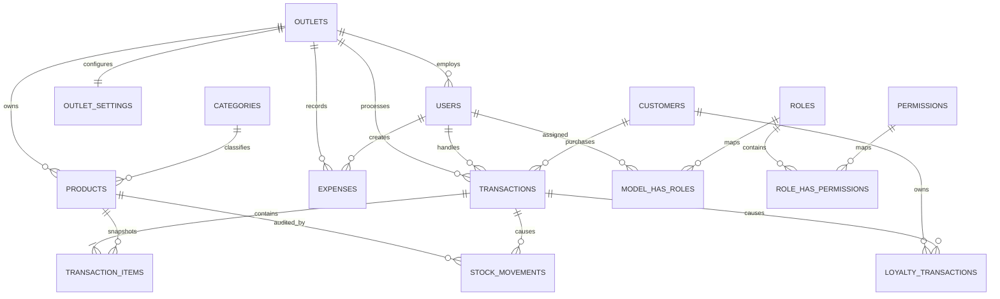

# Entity Relationship Diagram

## Keputusan desain

- Produk dan transaksi terisolasi berdasarkan `outlet_id`.
- Kategori serta member berlaku untuk seluruh jaringan outlet.
- `transaction_items` menyimpan snapshot nama, barcode, kategori, modal, dan harga. Laporan lama tetap valid walaupun produk kemudian berubah.
- `stock_movements` menjadi audit trail untuk stok awal, penjualan, dan adjustment.
- `loyalty_transactions` menyimpan histori earn/redeem dan saldo setelah transaksi.
- Setting pajak, service charge, branding, QRIS, serta rasio poin tersimpan per outlet.
